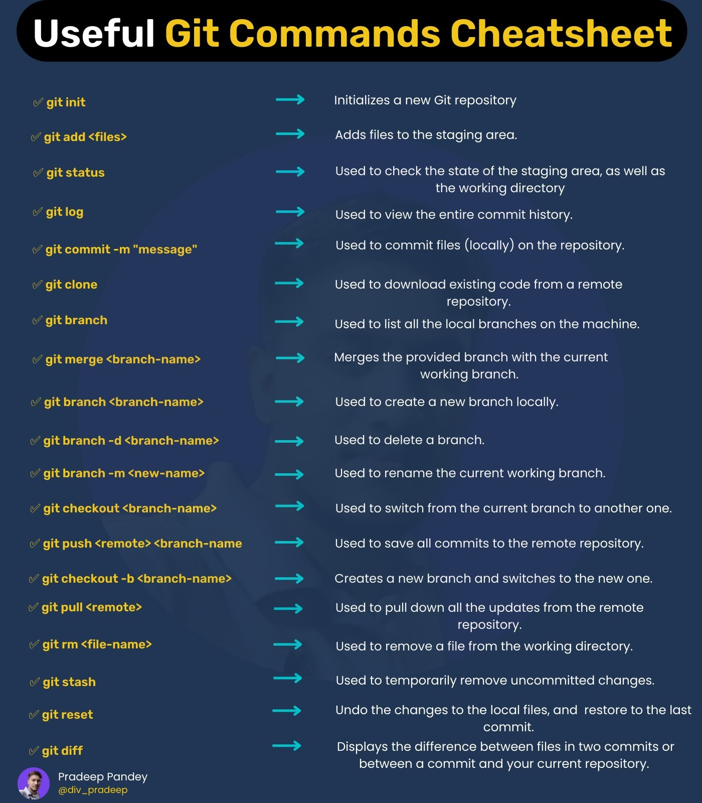

# Markdown examples

## Headers
# \# === H1
## \## === H2
### \### === H3
#### \#### === H4
##### \##### === H5
###### \###### === H6

___
## Separator lines
\_\_\_
___
## Unordered lists
- \- === ul > li
- \- === ul > li
- \- === ul > li

___
## Ordered lists
1. \1. === ol > li
2. \2. === ol > li
3. \3. === ol > li

___
## Bold & italic
*Wrap the text with \* to apply italic*

**Wrap the text with \*\* to apply bold**

***Wrap the text with \*\*\* to apply italic and bold***

___
## Links
\[Md examples\]\(https://markdown.es/sintaxis-markdown\) === \<a href="https://markdown.es/sintaxis-markdown"\>Md examples\</a\>

[Md examples](https://markdown.es/sintaxis-markdown/)

___
## Images
\!\[Git cheatsheet\]\(./git.jpg\) === \\</img\>

___
## Code
~~~
Wrap the code with \~\~\~ to apply code box
~~~
